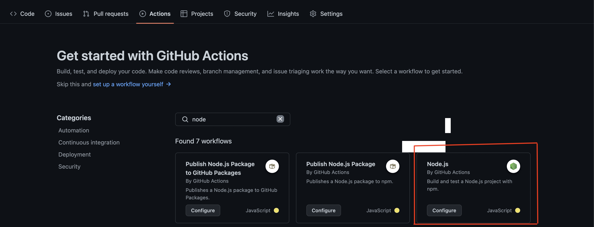
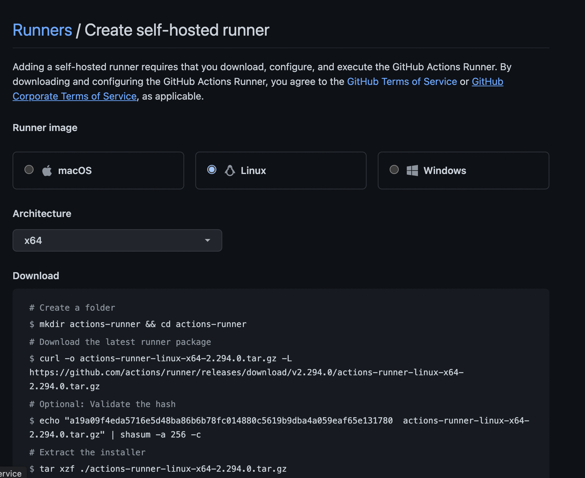
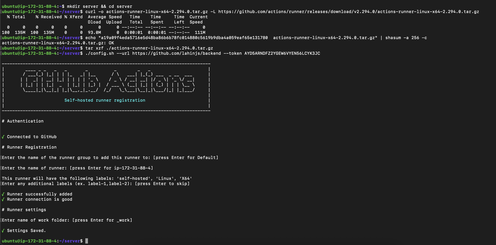

# CI/CD a Node app with GitHub Action

## AWS Part

* Step 1: Create an EC2 instance with Ubuntu OS.

* Step 2: Navigate you instance with ssh ssh -i "node-react.pem"..... command.

* Step 3: Then type `sudo apt update`.

* Step 4: Type `sudo apt install nginx nodejs npm`.

* Step 5: Click your Public IPv4 DNS you will a page like this.

<p align="center">
  
</p>

If you get this, it means NGINX is installed in your instance.

* Step 6: Install pm2 via `sudo npm i -g pm2`.

## Repository Part

* Step 1: Go to your server code and click Actions tab and type node and click the configure of Node.js.

<p align="center">
  
</p>

* Step 2: Add these two lines inside .github -> workflows -> node.js.yml.

```
- run: npm run build --if-present
- run: sudo pm2 restart server
```

And remove this line `- run: npm run test` (not needed for now)

* Step 3: Go to settings -> actions -> runners and click New self hosted runner.

* Step 4: Click Linux.

<p align="center">
  
</p>

## Combine

Type the commands you see after you select Linux inside your Instance Environment.

* Step 1: Type `mkdir server && cd server`. (as server is our repo name)

* Step 2: Type `curl -o actions-runner-linux-x64-2.294.0.tar.gz -L https://github.com/actions/runner/releases/download/v2.294.0/actions-runner-linux-x64-2.294.0.tar.gz`.

* Step 3: Type `echo "a19a09f4eda5716e5d48ba86b6b78fc014880c5619b9dba4a059eaf65e131780  actions-runner-linux-x64-2.294.0.tar.gz" | shasum -a 256 -c`.

* Step 4: Type `tar xzf ./actions-runner-linux-x64-2.294.0.tar.gz`.

* Step 5: Type `./config.sh --url https://github.com/lahinjs/server --token AYD5ARNDFZ2YGEW6VYEN56LCYK3JC`.

<p align="center">
  
</p>

* Step 6: Type `sudo ./svc.sh install`.

* Step 7: Type `sudo ./svc.sh start`.

Refresh or Navigate your runner page you will see the new runner created.

Change something of your code and commit to github repo. Then inside the instance service folder you will see _work folder created.

Navigate to this _work folder (cd _work). Then again navigate twice (cd server && cd server).

* Step 8: Type `sudo pm2 start app.js --name=server` (app.js is entry file)

This is the end. Let me know if you stuck.